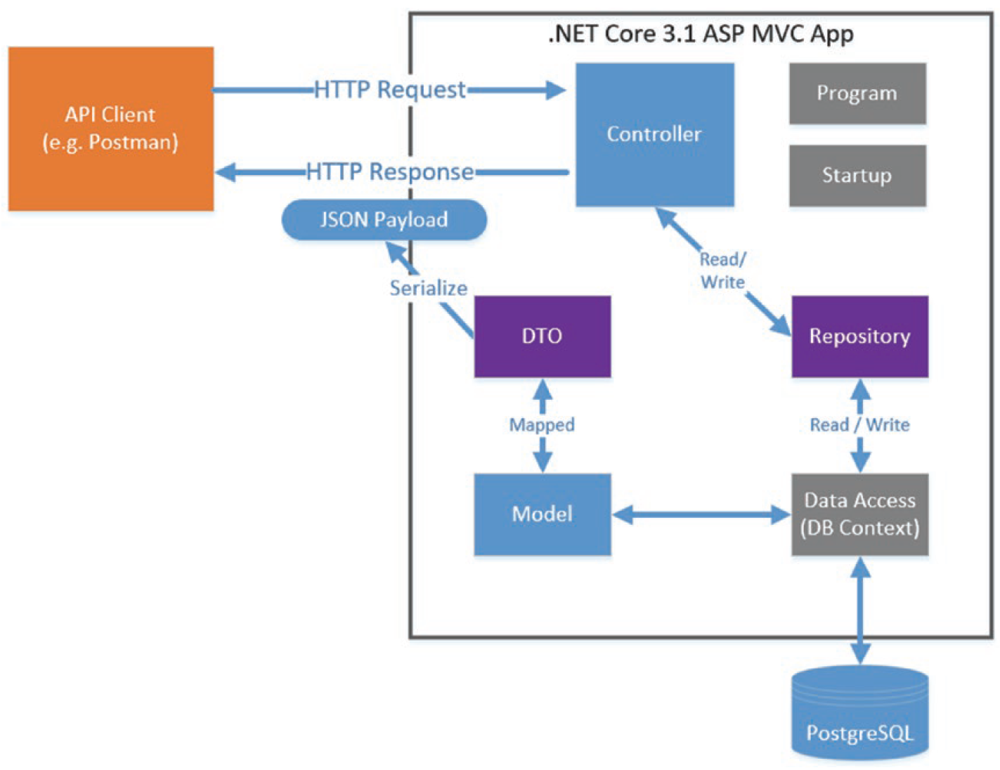

# CommandAPI

## Description
API for storing command-line snippets (e.g. dotnet new web -n &lt;project name>)

>**NOTE**: Based on the book [The Complete ASP.NET Core 3 API Tutorial](https://www.amazon.com/stores/Les-Jackson/author/B084L9B8CB?ref=ap_rdr&store_ref=ap_rdr&isDramIntegrated=true&shoppingPortalEnabled=true)

## Endpoints

| Verb   | URI                  | Operation       | Description                                |
|--------|----------------------|-----------------|--------------------------------------------|
| GET    | /api/commands        | Read            | Read all command resources                  |
| GET    | /api/commands/{Id}   | Read            | Read a single resource (by Id)              |
| POST   | /api/commands        | Create          | Create a new resource                       |
| PUT    | /api/commands/{Id}   | Update (Full)   | Update all of a single resource (by Id)     |
| PATCH  | /api/commands/{Id}   | Update (Partial)| Update part of a single resource (by Id)    |
| DELETE | /api/commands/{Id}   | Delete          | Delete a single resource (by Id)            |

## Technologies
- Docker
- PostgreSQL
- DBeaver
- .NET Core

## References
- [Les Jackson YouTube Channel](https://www.youtube.com/@binarythistle/playlists) 
- [Les Jackson Blog](https://dotnetplaybook.com/)

## API Application Architecture
